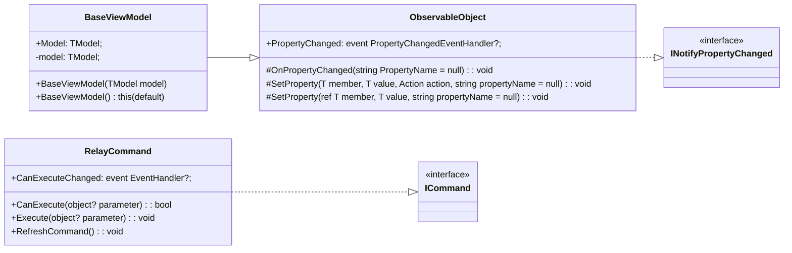

# **Compte Rendu TP2-TP3 - MVVM Bruno DA COSTA CUNHA**

> **ANDROID & IOS**: L'application est fonctionnelle sur Android et sur IOS. 

> Branches à noter:
- Pour accéder au code de l'application et profiter de l'intégralité des fonctionnalités du TP2, veuillez vous rendre sur la branche **TP2**.
- Pour accéder au code de l'application et profiter de l'intégralité des fonctionnalités du TP3, veuillez vous rendre sur la branche **TP3**.

## MyToolKit : 
  
Voici la structure de "MyToolKit" :

## Fonctionnalités :

**TP2 - MVVM Base** : 
1. [x] page d'accueil : en utilisant une _ContentView_ et des _Commands_, faites en sorte que l'utilisateur puisse :
      
2. [x] affichage des livres de l'utilisateur : afficher tous les livres de l'utilisateur dans la vue _MyList_ et permettre la sélection d'un livre et la navigation vers la page _BookDetail_
  
3. [x] filtrage par auteur et par date de publication : afficher dans la vue de filtrage (_FilterPage_)
	**Note : Pour des raisons de gestion du temps, j'ai concentré mes efforts que sur la mise en place du filtrage par auteur.**
    
  
**TP2 - MVVM Ajouts** :  

L'application doit maintenant permettre de naviguer sur toutes les pages et l'utilisateur doit pouvoir :
- [ ] changer le statut de lecture d'un livre,
- [x] ajouter un livre aux favoris,
- [x] filtrer les livres par **Auteur**, **Date de publication**, **Note**
  **Note : En raison de contraintes de temps, j'ai mis en place uniquement le filtrage par auteur.**
- [x] ajouter un livre à sa collection en saisissant l'ISBN (les vues seront à ajouter)
- [x] supprimer un livre
- [ ] prêter un livre (et ajouter un contact si besoin)
- [ ] consulter la liste des livres prêtés. 
- [x] Lors de la consultation des livres, il faudra gérer la pagination pour que l'on puisse limiter l'affichage à n (5, 10, 20,...) livres par page.
  **Note :  Lors de la consultation des livres, la pagination est implémentée pour afficher 10 livres par page. Cependant, il n'y a pas d'option permettant à l'utilisateur de choisir le nombre de livres par page.**

**TP3 : utilisation du MVVM Community Toolkit** :

- [X] Modifier tout le code afin d'utiliser MVVM Community ToolKit à la place de mon ToolKit personnel
  
_Erreurs rencontrées et remarques_ :

* Sur iOS, le comptage des livres dans la page "Auteurs" (filtrage par auteur) ne fonctionne pas, tandis que sur mon téléphone Android, cela s'effectue correctement.
* Également sur iOS, étant donné que j'ai implémenté un TapGestureRecognizer sur la grille, il est nécessaire de cliquer légèrement à côté du bouton "+" sur la page principale.

* J'ai supprimé le pop-up qui s'affichait lorsque l'utilisateur cliquait sur le bouton "+" de la page principale fait au TP1. Cela a été fait parce que je ne pouvais pas utiliser mes commandes avec un objet de type PopUp. Désormais, en cliquant sur le bouton "+", vous serez redirigé vers une nouvelle page où vous pourrez ajouter un livre en saisissant son ISBN.

* Lorsque j'ajoute un livre aux favoris et que je vais sur une autre page de détails de livre, le bouton "Ajouter aux favoris" ne se met pas à jour automatiquement pour refléter le statut actuel. Cependant, il s'agit d'un problème d'affichage, car je peux toujours ajouter et retirer des livres de mes favoris sans problème.

* Au lancement de l'application, le compteur de livres est affiché à zéro car les livres ne sont chargés qu'au moment où l'utilisateur clique sur le bouton "Tous".

* Lors du TP3 je n'ai pas utilisé [RelayCommand] pour ma NavigationVM.

* Le TP4 n'a pas été fait.
  

*******