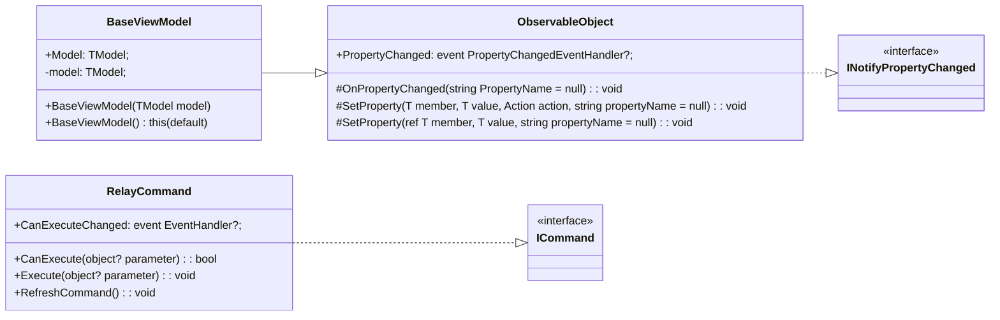

# **Compte Rendu TP2-TP3 - MVVM Bruno DA COSTA CUNHA**

> **ANDROID & IOS**: L'application est fonctionnelle sur Android et sur IOS. 

- Pour accéder au code de l'application et profiter de l'intégralité des fonctionnalités du TP2, veuillez vous rendre sur la branche **TP2**.
- Pour accéder au code de l'application et profiter de l'intégralité des fonctionnalités du TP3, veuillez vous rendre sur la branche **TP3**.

## MyToolKit : 
  
Voici la structure de "MyToolKit" :

## Fonctionnalités :

**TP2 - MVVM Base** : 
1.  [x] page d'accueil : en utilisant une _ContentView_ et des _Commands_, faites en sorte que l'utilisateur puisse :
      
2.  [x] affichage des livres de l'utilisateur : afficher tous les livres de l'utilisateur dans la vue _MyList_ et permettre la sélection d'un livre et la navigation vers la page _BookDetail_
  
3.  [x] filtrage par auteur et par date de publication : afficher dans la vue de filtrage (_FilterPage_)
	Pour des raisons de gestion du temps, j'ai concentré mes efforts que sur la mise en place du filtrage par auteur.
    
  
**TP2 - MVVM Ajouts** :  

L'application doit maintenant permettre de naviguer sur toutes les pages et l'utilisateur doit pouvoir :
- [ ] changer le statut de lecture d'un livre,
-  [x] ajouter un livre aux favoris,
-  [x] filtrer les livres par **Auteur**, **Date de publication**, **Note**
  **Pour cela j'ai fait seulement le filtrage par auteur pour optimiser le temps.**
-  [x] ajouter un livre à sa collection en saisissant l'ISBN (les vues seront à ajouter)
-  [x] supprimer un livre
- [ ] prêter un livre (et ajouter un contact si besoin)
- [ ] consulter la liste des livres prêtés. 
-  [x] Lors de la consultation des livres, il faudra gérer la pagination pour que l'on puisse limiter l'affichage à n (5, 10, 20,...) livres par page.
  **La pagination est fait pour l'affichage des livres, mais je n'ai pas laissé le choix à l'utilisateur, l'affichage est limité à 10 livres par page.**

**TP3 : utilisation du MVVM Community Toolkit** :

- [X] Modifier tout le code afin d'utiliser MVVM Community ToolKit à la place de mon ToolKit personnel
  
_Erreurs rencontrées et remarques_ :

* J'ai dû d'enlever le pop-up fait au TP1 lorsqu'ont clique dans le bouton + de la page principale, car je n'arrivais pas à utiliser mes commands sur un type PopUp. Donc le bouton plus ira vous ammener vers une page pour pouvoir ajouter le ISBN afin d'ajouter un livre.

* Lors que j'ajoute un livre aux favoris et que j'aille sur un autre livreDetail, le bouton d'ajouter un livre ne se met pas à jour automatiquement, mais c'est juste l'affichage, j'arrive quand même à ajouter des livres en favoris.

* Le compteur de livres lors qu'on lance l'application est egale à 0 car je fais le chargement juste quand on clique dans le bouton "Tous".

* Lors du TP3 je n'ai pas utilisé [RelayCommand] pour ma NavigationVM

* Le TP4 n'a pas été fait
  

*******